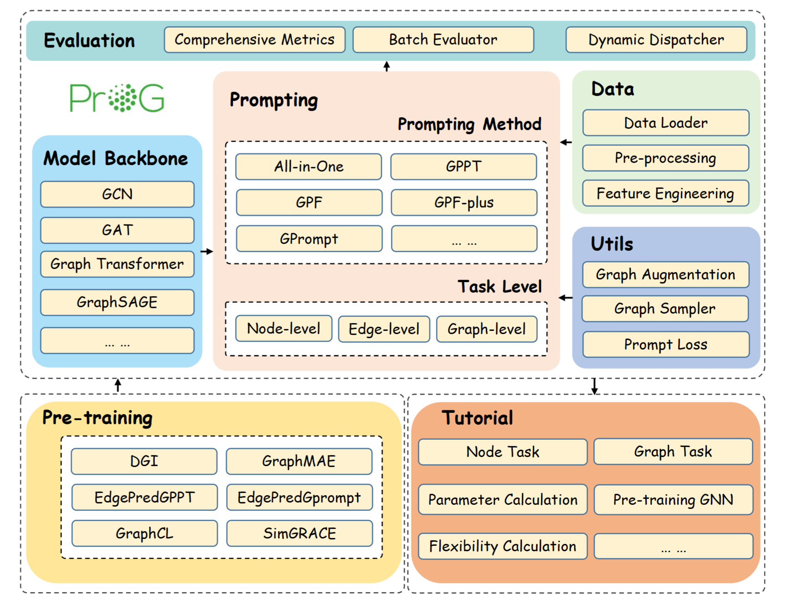

# ProG-V2: A Reproducible Graph Prompt Learning Benchmark

<p align="center">
  
</p>

ProG-V2 is an engineering-focused extension of the original
[ProG benchmark](https://github.com/sheldonresearch/ProG) for graph prompt
learning. It keeps the standard **pre-train → prompt-tune → evaluate** workflow,
while adding a modular prompt-strategy architecture, broader prompt coverage,
centralized path/device/logging utilities, benchmark scripts, tests, and public
merged result reports.

## What's New in ProG-V2

- **17 prompt strategies** registered through a `PromptStrategy` registry.
- **6 GNN backbones** registered through `prompt_graph.model.build_gnn`.
- Reproducible few-shot benchmark utilities for node- and graph-level tasks.
- Centralized filesystem paths, device resolution, logging, and CLI/YAML config.
- Tests for data loading, GNN factory construction, strategy registration, and
  prompt-task smoke runs.
- Fixes for several benchmark-blocking edge cases in WebKB, MultiGprompt,
  RELIEF, and GraphMAE.

## Architecture

<p align="center">
  
</p>

## Overall Performance Results

We provide a public merged GCN Overall Performance report under
[`results/overall-performance-gcn/`](./results/overall-performance-gcn/).

The report contains **714 independent `(dataset, shot, pretrain+prompt)`
combinations** and **2142 metric values** over Accuracy, Macro-F1, and AUROC.

Experiment parameters:

| Setting | Value |
|---|---|
| Backbone | GCN |
| GNN layers | 2 |
| Hidden dimension | 128 |
| Seed | 42 |
| Shots | 1-shot, 3-shot, 5-shot |
| Few-shot splits | 5 splits per shot setting (`mean±std`) |
| Downstream budget | 50 epochs with early stopping |
| Pretrain budget | 200 epochs for generated checkpoints |
| Metrics | Accuracy, Macro-F1, AUROC |
| Result format | `{pretrain}+{prompt}` columns |

Coverage:

| Dataset | Task | 1-shot | 3-shot | 5-shot |
|---|---|---:|---:|---:|
| Cora | Node | 72 | 72 | 72 |
| Wisconsin | Node | 59 | 59 | 59 |
| MUTAG | Graph | 56 | 56 | 56 |
| PROTEINS | Graph | 51 | 51 | 51 |

Result files:

- [`summary.csv`](./results/overall-performance-gcn/summary.csv): flat table,
  one row per experiment combination.
- [`final_matrices.xlsx`](./results/overall-performance-gcn/final_matrices.xlsx):
  12 sheets, one per `(dataset, shot)` task view.
- [`README.md`](./results/overall-performance-gcn/README.md): detailed result
  documentation and metric definitions.

The merged table currently uses **GCN**. Other backbones are available in the
model registry but are not part of this public Overall Performance table.

## Installation

Use Python 3.9 or 3.11. Python 3.11 is recommended for local development.

```bash
conda create -n prog-v2 python=3.11 -y
conda activate prog-v2
pip install -e ".[dev]"
pre-commit install
```

If PyTorch Geometric extension wheels are not resolved automatically, install the
matching wheels for your PyTorch/CUDA version from the official PyG wheel index:

```bash
python -m pip install torch_scatter torch_sparse -f https://data.pyg.org/whl/
```

## Quick Start

Run a minimal downstream task:

```bash
python downstream_task.py \
  --downstream_task NodeTask \
  --dataset_name Cora \
  --gnn_type GCN \
  --prompt_type GPF \
  --shot_num 1 \
  --epochs 1 \
  --device cpu
```

Run a small benchmark cell and write an Excel matrix:

```bash
python scripts/bootstrap_excel_full.py --gnn_type GCN
python bench.py \
  --pretrain_task NodeTask \
  --dataset_name Cora \
  --prompt_type None \
  --gnn_type GCN \
  --shot_num 1 \
  --epochs 1 \
  --device cpu \
  --pre_train_model_path None \
  --num_iter 1
```

For a tested tutorial entry point, see
[`Tutorial/quickstart_progv2.py`](./Tutorial/quickstart_progv2.py).

## Supported Components

### Backbones

- `GCN`
- `GAT`
- `GIN`
- `GraphSAGE`
- `GCov`
- `GraphTransformer`

### Pretraining Methods

- `DGI`
- `GraphMAE`
- `GraphCL`
- `SimGRACE`
- `Edgepred_GPPT`
- `Edgepred_Gprompt`
- `MultiGprompt`

### Prompt Strategies

`None`, `GPF`, `GPF-plus`, `Gprompt`, `All-in-one`, `GPPT`, `Prodigy`,
`GraphPrompter`, `EdgePrompt`, `EdgePromptplus`, `RELIEF`, `MultiGprompt`,
`UniPrompt`, `SelfPro`, `ProNoG`, `PSP`, and `DAGPrompT`.

## Scripts

The public sweep scripts are parameterized by `--gnn_type`:

```bash
bash scripts/pretrain_full_grid.sh --gnn_type GCN --fast
bash scripts/bench_full_grid.sh --gnn_type GCN --fast --datasets "Cora MUTAG"
```

Useful scripts:

| Script | Purpose |
|---|---|
| `scripts/bootstrap_excel_full.py` | Create empty Excel matrices for a selected backbone. |
| `scripts/pretrain_full_grid.sh` | Pretrain selected methods/datasets/backbone. |
| `scripts/bench_full_grid.sh` | Run the full project benchmark grid with filters. |
| `scripts/pretrain_paper_grid.sh` | Run the paper-scope pretraining grid. |
| `scripts/bench_overall_performance.sh` | Run the paper-scope Overall Performance grid. |
| `scripts/merge_result_excels.py` | Merge per-run Excel outputs into one report. |

## Development Checks

```bash
ruff check .
ruff format --check .
pytest tests/ -v
```

For contribution guidelines, see [`CONTRIBUTING.md`](./CONTRIBUTING.md).

## Citation

If you find this project useful, please cite the original ProG/graph prompt work:

```bibtex
@article{zi2024prog,
  title={ProG: A Graph Prompt Learning Benchmark},
  author={Chenyi Zi and Haihong Zhao and Xiangguo Sun and Yiqing Lin and Hong Cheng and Jia Li},
  year={2024},
  journal={Advances in Neural Information Processing Systems}
}

@inproceedings{sun2023all,
  title={All in One: Multi-Task Prompting for Graph Neural Networks},
  author={Sun, Xiangguo and Cheng, Hong and Li, Jia and Liu, Bo and Guan, Jihong},
  booktitle={Proceedings of the 29th ACM SIGKDD Conference on Knowledge Discovery and Data Mining},
  year={2023}
}
```
